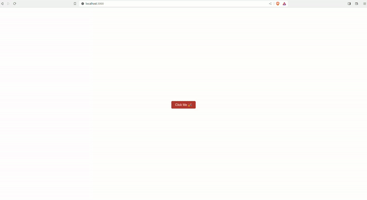

# CSS Modules Demo

## Overview

This React project demonstrates the integration of CSS Modules for component styling and incorporates `react-confetti` for interactive UI effects. The main feature of this application is a button that, when clicked, changes the background color of the page and triggers a confetti animation, creating a visually engaging user experience.

## Key Features

- **React with CSS Modules**: The application showcases the use of CSS Modules for styling React components. This approach modularizes CSS by allowing styles to be defined in separate files and imported as JavaScript objects, ensuring style encapsulation and reducing the risk of style conflicts.
- **Interactive UI with Confetti Effect**: Utilizing `react-confetti` version 6.1.0, the application creates a confetti explosion effect when the button is clicked, enhancing the interactivity of the UI.

## Technologies Used

- React
- CSS Modules
- react-confetti (version 6.1.0)

## Running the Project Locally

To run this project on your local machine, follow these steps:

1. **Clone the Repository**
   
   Clone the project repository to your local machine using:
   ```
   git clone git@github.com:labcodes/css-modules-demo.git
   ```

2. **Navigate to the Project Directory**
   
   After cloning, move into the project directory:
   ```
   cd css-modules-demo
   ```

3. **Install Dependencies**
   
   Install the necessary dependencies by running:
   ```
   npm install
   ```

4. **Start the Development Server**
   
   Launch the development server with:
   ```
   npm start
   ```
   This will run the app in development mode. Open [http://localhost:3000](http://localhost:3000) to view it in your browser.

  

5. **Explore the App**
   
   The page will reload if you make edits. You will also see any lint errors in the console.

## Contributing

Feel free to contribute to this project by submitting pull requests or suggesting features or improvements.
